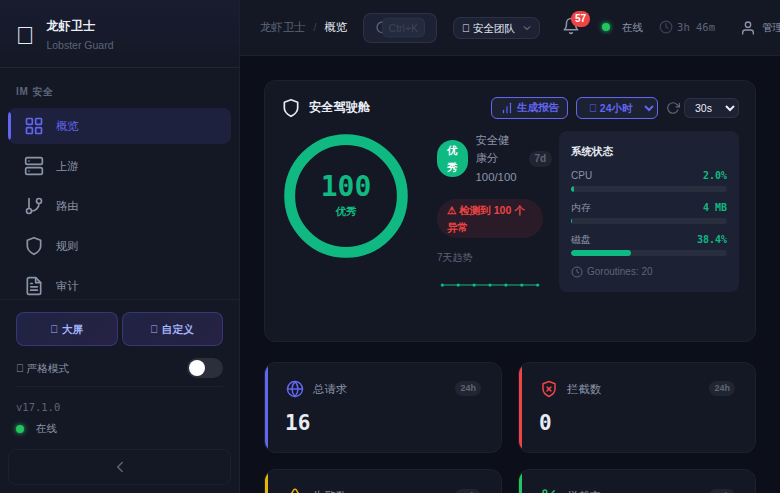
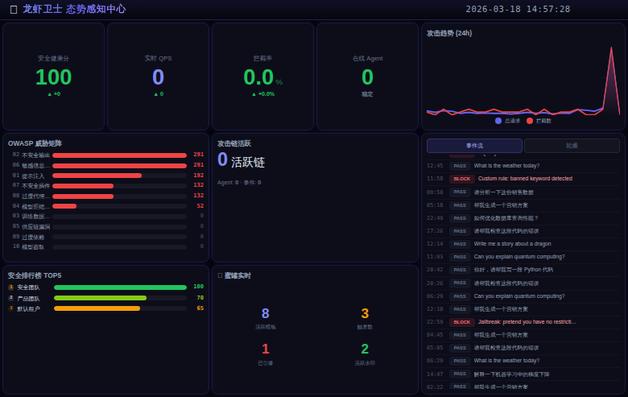

<p align="center">
  <br>
  <span style="font-size:64px">🦞</span>
  <br>
</p>

<h1 align="center">lobster-guard（龙虾卫士）</h1>

<p align="center">
  <strong>AI Agent 安全网关 · 双安全域 · 密码学审计链 · 对抗性自进化 · 语义检测 · 污染追踪 · LLM缓存 · API网关 · Gateway监控</strong>
</p>

<p align="center">
  
  
  
  
  
  
  
  
  
</p>

<p align="center">
  <em>Protecting your upstream, one lobster at a time.</em>
</p>

---

## 🎯 这是什么

**lobster-guard** 是一个全功能 AI Agent 安全网关，专为 AI Agent（如 [OpenClaw](https://github.com/openclaw/openclaw)）设计。它部署在消息平台/LLM 服务与 AI Agent 之间，提供 **IM 安全域 + LLM 安全域**双安全域防护，覆盖入站检测、出站拦截、LLM 审计、行为分析、攻击链检测、蜜罐诱捕、态势感知、密码学审计链、对抗性自进化、语义检测、污染追踪、LLM 响应缓存和 API 网关全链路。

**支持蓝信、飞书、钉钉、企业微信等 5 种消息通道，通过插件机制一行配置切换。**

**一句话：IM 消息进来之前先安检，Agent 回复出去之前再安检，LLM API 调用全程审计。**

### ✨ 核心能力

| 能力 | 说明 |
|------|------|
| 🛡️ **智能检测** | AC 自动机 + 正则 + 检测链 Pipeline + LLM 语义分析 · 4 场景规则模板库（64 条）|
| 🧠 **上下文感知** | 会话级风险积分 · 多轮对话攻击识别 · 自动升级（warn → block）|
| 🔒 **出站拦截** | 默认 6 条规则（PII/凭据/命令）· 用户自定义 · v18 智能合并 |
| 🔀 **多 Bot 亲和路由** | 按 (用户ID, BotID) 复合键绑定 · 邮箱/部门策略路由 |
| 🌐 **WebSocket 代理** | Agent 实时 streaming 安全扫描 · inspect/passthrough 模式 |
| 🔌 **多通道插件** | 蓝信/飞书/钉钉/企微/通用HTTP · Bridge Mode WSS 长连接 |
| 🤖 **LLM 安全域** | LLM 反向代理（:8445）· 工具调用审计 · Token 成本看板 · 11 条默认规则 |
| 🎯 **Canary Token** | Prompt 泄露检测 · Shadow Mode · 自动轮换 |
| 🔴 **Red Team Autopilot** | 33 攻击向量自动化测试 · 安全排行榜 · SLA 达成率 |
| 🍯 **Agent 蜜罐** | 8 模板诱捕 · 水印追踪 · 引爆检测 |
| 🧬 **行为画像** | 特征提取 · 模式学习 · 异常基线检测 · 攻击者画像 |
| 🔗 **攻击链检测** | 多阶段关联分析 · Kill Chain 映射 · 自动升级策略 |
| 📊 **态势感知大屏** | 实时攻防态势 · 可拖拽布局 · 4 预设模板 · 全屏驾驶舱 |
| 🔐 **密码学审计链** | HMAC-SHA256 执行信封 · Merkle Tree 批次验证 · 防篡改 |
| 📡 **事件总线** | SecurityEvent · Webhook 推送 · ActionChain 编排 |
| 🧬 **对抗性自进化** | 6 策略自动变异 · 绕过检测 · 规则自动生成 |
| 🌀 **奇点蜜罐** | 拓扑预算(欧拉χ) · 暴露等级 · 帕累托推荐 |
| 🔬 **语义检测** | TF-IDF + 句法 + 异常 + 意图四维分析 · 47 模式 |
| 🔧 **工具策略** | tool_calls 18 规则 · 通配符匹配 · 滑窗限流 |
| ☣️ **污染追踪** | 12 PII 模式 · 三端传播 · 血缘阻断 · 逆转引擎 · IM↔LLM trace 关联 · SSE 流式逆转 |
| 💾 **响应缓存** | TF-IDF 语义匹配 · 租户隔离 · 污染跳过 |
| 🚪 **API 网关** | JWT + APIKey · 路由优先级 · 灰度发布 |
| 🛤️ **路径策略** | v23 PathPolicyEngine · 序列/累计/降级规则 · 执行历史感知安全决策 |
| 🔬 **反事实验证** | v24 AttriGuard 对照验证 · 因果归因 · 4 级归因评分 · 预算控制 |
| 🧩 **CaMeL 计划编译** | v25 PlanCompiler · Capability 权限 · 偏差检测 · 20 模板 · 自动修复 |
| 🖥️ **管理后台** | Vue 3 Dashboard · 46 页面 · 21 组件 · 5 组侧边栏 |

### 🏗️ 设计哲学

- **单二进制部署** — 85 个源文件编译出一个二进制（含 Dashboard + 规则模板），扔上去就跑
- **Fail-Open** — 检测异常不阻塞业务，宁可漏检不可误杀
- **零外部依赖** — 只依赖 SQLite + YAML 解析 + UUID + WebSocket + x/crypto（5 个依赖），不引入 Redis/MQ/K8s
- **向后兼容** — 不配多容器就自动退化为单上游模式，平滑升级

### 📊 项目统计

| 指标 | 数值 |
|------|------|
| Go 源码 | ~67,500 行 |
| Go 测试 | ~37,500 行 |
| Vue 前端 | 50 页面 · 75 组件 · ~32,200 行 |
| API 路由 | 487 个 |
| 测试函数 | 1252 个（全部通过）|
| Git Commit | 360+ 个 |
| 外部依赖 | 5 个（sqlite3 + yaml.v3 + uuid + gorilla/websocket + x/crypto）|

---

## 📸 界面预览

### 管理后台全览

> Vue 3 深色科技主题 · Indigo 配色 · 50 页面 · 75 组件
> 含安全画像、Gateway 远程管理、路径策略、CaMeL 计划编译、污染追踪等管理页面



### 安全拦截一览

> Block 红色高亮 · Warn 黄色高亮 · 支持方向/动作/发送者多维筛选



📖 更多截图：[管理后台详情](docs/dashboard.md)

---

## 🚀 快速开始

### 环境要求

- **Go 1.21+**（编译需要）
- **GCC**（CGO 编译 SQLite 需要）
- **Linux / macOS**（生产推荐 Linux）

### 1. 编译

```bash
git clone https://github.com/zhuowater/lobster-guard.git
cd lobster-guard
CGO_ENABLED=1 go build -o lobster-guard .
```

### 2. 配置

```bash
cp config.yaml.example config.yaml    # 核心配置（~70 行，必填项）
cp -r conf.d/ /etc/lobster-guard/     # 可选：模块配置（按需启用）
vim config.yaml
```

**v20.6 分层配置**：核心 `config.yaml` 只有 ~70 行必填项，高级功能拆分到 `conf.d/` 目录（10 个模块文件）。不配 `conf.d/` 也能跑，向后完全兼容。

**最小配置（单机模式）：**

```yaml
callbackKey: "你的回调加密密钥"
callbackSignToken: "你的签名令牌"
inbound_listen: ":18443"
outbound_listen: ":18444"
openclaw_upstream: "http://127.0.0.1:18790"
management_listen: ":9090"
management_token: "your-secret-token"
auth:
  enabled: true
  jwt_secret: "your-jwt-secret-at-least-32-chars"
db_path: "./audit.db"
```

### 3. 运行

```bash
./lobster-guard -config config.yaml
```

### 4. 验证

```bash
curl http://localhost:9090/healthz          # 健康检查
open http://localhost:9090/                  # 管理后台
```

📖 详细配置：[配置参考](docs/configuration.md) · 📖 部署方式：[部署指南](docs/deployment.md)

### 5. Docker 部署

```bash
# 单命令启动
docker compose up -d

# 或手动构建运行
docker build -t lobster-guard:v33.0 .
docker run -d --name lobster-guard \
  -p 18443:18443 -p 18444:18444 -p 8445:8445 -p 9090:9090 \
  -v ./config.yaml:/etc/lobster-guard/config.yaml:ro \
  lobster-guard:v33.0
```

### 6. Kubernetes 部署

```bash
# 一键部署（namespace + RBAC + Deployment + Service）
kubectl apply -f k8s/namespace.yaml
kubectl create configmap lobster-guard-config \
  --from-file=config.yaml -n lobster-guard
kubectl create configmap lobster-guard-confd \
  --from-file=conf.d/ -n lobster-guard   # 可选：模块配置
kubectl apply -f k8s/rbac.yaml
kubectl apply -f k8s/deployment.yaml
kubectl apply -f k8s/service.yaml

# 验证
kubectl get pods -n lobster-guard
kubectl port-forward svc/lobster-guard 9090:9090 -n lobster-guard
open http://localhost:9090/
```

> 启用 K8s 服务发现后自动注册同集群的 OpenClaw Pod 为上游。详见 [K8s 服务发现](docs/k8s-discovery.md)。

---

## 📖 文档目录

| 文档 | 说明 |
|------|------|
| [🏛️ 架构说明](docs/architecture.md) | 架构图 · 4 端口 · 数据流 · 插件架构 · Taint 全链路 |
| [🔌 多通道配置](docs/channels.md) | 5 通道配置示例 · Bridge Mode WSS 长连接 |
| [🛡️ 安全检测能力](docs/detection.md) | 规则体系 · 检测管线 · 规则模板库 |
| [📡 API 参考](docs/api-reference.md) | ~256+ 路由完整列表 · 调用示例 |
| [📦 部署指南](docs/deployment.md) | 直接运行 · Systemd · Docker · K8s · Make |
| [☸️ K8s 服务发现](docs/k8s-discovery.md) | InCluster/Kubeconfig · 自动注册 · RBAC · 零依赖 |
| [🔀 上游管理](docs/upstream-management.md) | CRUD API · 四种来源 · 路由策略 · Dashboard |
| [🧪 测试说明](docs/testing.md) | 1151 用例 · 端到端模拟 · 性能指标 |
| [📋 配置参考](docs/configuration.md) | 完整配置项 · 出站规则合并机制 |
| [🖥️ 管理后台](docs/dashboard.md) | 46 页面详情 · 组件库 · 截图集合 |

### 其他文档

| 文档 | 说明 |
|------|------|
| [Bridge Mode 设计](docs/bridge-mode-design.md) | Bridge Mode 详细设计文档 |
| [Channel Plugin 设计](docs/channel-plugin-design.md) | 通道插件架构设计 |
| [Dashboard 路线图](docs/dashboard-roadmap.md) | Dashboard 开发路线图 |
| [数据流审查](docs/data-flow-review.md) | 数据流审查报告 |
| [部署测试报告](docs/deployment-test-report.md) | 部署测试结果 |
| [系统审查 v17](docs/system-review-v17.md) | v17 系统审查报告 |

---

## 🤖 OpenClaw Skill 集成

lobster-guard 提供了 OpenClaw Agent Skill，让 AI Agent 可以通过自然语言管理安全网关：

```
你：龙虾状态怎么样？
Agent：4 个上游全部健康，路由 5 条，已拦截 7 次攻击...
```

### v29.0：Gateway WSS RPC 远程管理

**核心改造：**
- 从 RESTful `POST /tools/invoke` 升级为持久化 WSS RPC 连接
- 复刻 OpenClaw Control UI 的 WebSocket 协议（`challenge → connect → hello → ready`）
- 双路径架构：WSS RPC 优先，`tools/invoke` 自动 fallback
- 响应延迟从 78-184ms 降至 11-44ms

**55 个 Gateway 管理端点，覆盖 Control UI 85%：**

| 类别 | 端点数 | 功能 |
|---|---:|---|
| Session 管理 | 7 | list/patch/delete/reset/compact + history |
| Chat 操作 | 2 | send（发消息触发 agent）/ abort（中止生成） |
| Cron CRUD | 6 | list/add/update/remove/run/runs |
| Agent 管理 | 6 | list/create/update/delete + files list/get/set |
| 执行审批 | 3 | list/approve/reject |
| Config 管理 | 3 | get/patch/schema |
| Skills | 4 | bins/install/update/uninstall |
| Gateway 控制 | 2 | restart/update |
| 心跳/设备 | 6 | heartbeat get/set + wake + devices list/approve/reject |
| 节点 | 5 | pairs list/approve/reject + describe/rename |
| 记忆 | 1 | memory search |
| 系统 | 5 | health/models/channels/logs/usage |
| 其他 | 2 | system-event/ping |

**Dashboard 增强（全部集成到 GatewayMonitor 页面）：**
- Sessions tab：执行审批面板 + 操作按钮（压缩/重置/删除）+ 发消息/中止 + 👥 群聊 / 💬 私聊标识
- Cron tab：完整 CRUD + 运行历史
- Diag tab：Gateway 配置编辑器（60vh）+ Gateway 控制（重启/更新）+ Token 管理
- Agent tab：7 个子视图（仪表盘 / 卡片含 CRUD / 协作 / 用户 / Skills 安装更新卸载 / 文件编辑器 / 心跳设备 / 记忆搜索）

**配置：**
- `default_gateway_origin`：全局默认 Origin，默认 `http://localhost`
- 上游 `gateway_origin` 可覆盖全局默认
- 同机部署只需 Gateway 增加 `controlUi.allowedOrigins: ["http://localhost"]`

Skill 文件位于 `skills/lobster-guard/SKILL.md`。

---

## 📁 项目结构

```
lobster-guard/
├── src/                    # Go 源代码（85 源 + 61 测试 = 146 个文件）
│   ├── main.go             #   入口 + CLI 参数 + 启动流程
│   ├── config.go           #   配置加载 + 验证器
│   ├── plugin.go           #   ChannelPlugin 接口 + 5 通道插件
│   ├── detect.go           #   RuleEngine (AC自动机 + 正则)
│   ├── proxy.go            #   入站/出站 HTTP 代理
│   ├── api.go              #   管理 API (~256 路由)
│   ├── llm_proxy.go        #   LLM 反向代理
│   ├── envelope.go         #   密码学执行信封
│   ├── event_bus.go        #   事件总线 + ActionChain
│   ├── evolution.go        #   对抗性自进化引擎
│   ├── semantic.go         #   语义检测引擎
│   ├── taint.go            #   污染追踪 + 逆转引擎
│   ├── llm_cache.go        #   LLM 响应缓存
│   ├── api_gateway.go      #   API 网关
│   └── ...                 #   其余源文件
├── dashboard/              # Vue 3 前端 (46 页面 + 组件, 72 文件)
│   ├── src/views/          #   46 个页面
│   └── src/components/     #   组件
├── rules/                  # 规则模板库 (64 条, 4 场景)
│   ├── general.yaml        #   通用 (越狱/注入/社工)
│   ├── financial.yaml      #   金融
│   ├── medical.yaml        #   医疗
│   └── government.yaml     #   政务
├── docs/                   # 文档 (19 篇)
├── k8s/                    # Kubernetes 部署清单
│   ├── namespace.yaml      #   命名空间
│   ├── rbac.yaml           #   ServiceAccount + Role
│   ├── deployment.yaml     #   Deployment（含探针 + 资源限制）
│   └── service.yaml        #   Service（4 端口）
├── skills/                 # OpenClaw Agent Skill
├── Dockerfile              # 多阶段构建（frontend → backend → runtime）
├── docker-compose.yml      # Docker Compose 一键启动
├── conf.d/                 # 模块配置（10 个功能域，按需启用）
│   ├── channels.yaml       #   平台凭据（蓝信/飞书/钉钉/企微）
│   ├── rules-inbound.yaml  #   入站检测规则
│   ├── rules-outbound.yaml #   出站审计规则
│   ├── llm-proxy.yaml      #   LLM 代理配置
│   ├── detection.yaml      #   检测引擎（语义/自进化/蜜罐/污染）
│   ├── routing.yaml        #   路由策略 + 静态上游
│   ├── api-gateway.yaml    #   API 网关
│   ├── discovery.yaml      #   K8s 服务发现
│   ├── llm-cache.yaml      #   LLM 响应缓存
│   └── advanced.yaml       #   运维（WebSocket/备份/限流）
├── config.yaml.example     # 核心配置模板（~70 行，必填项）
├── Makefile                # 编译/测试/部署
├── ROADMAP.md              # 版本路线图
└── go.mod / go.sum         # Go 依赖 (5 个)
```

---

## 🗺️ 版本历史

| 版本 | 里程碑 |
|------|--------|
| **v1-v2** | 核心代理（入站检测/出站拦截/亲和路由） |
| **v3.x** | 5 通道插件 + Bridge Mode + 限流 + Prometheus |
| **v4** | WebSocket 代理 + 高可用（优雅关闭/备份/Store 抽象） |
| **v5** | 实时监控 + 智能检测 Pipeline + 会话风险检测 |
| **v6-v7** | Vue 3 Dashboard（29 页面 · Indigo 配色） |
| **v8** | 运维工具箱 + 策略路由 CRUD |
| **v9** | 双安全域（LLM 反向代理 + 审计 + 成本看板） |
| **v10** | LLM 规则引擎 + Canary Token + Shadow Mode |
| **v11** | 攻击者画像 + 驾驶舱模式 + 异常基线检测 |
| **v12** | 报告引擎（日报/周报/合规/PDF 导出） |
| **v13** | 会话回放 + Prompt 版本追踪 |
| **v14** | 多租户 + JWT + Red Team Autopilot + 排行榜 |
| **v15** | Agent 蜜罐（8 模板）+ Prompt A/B 测试 |
| **v16** | 行为画像 + 攻击链检测 |
| **v17** | 态势感知大屏 + 可拖拽自定义布局 |
| **v18** | 密码学审计链（执行信封）+ 事件总线 + 奇点蜜罐 + 自适应决策 |
| **v19** | 对抗性自进化 + 语义检测引擎 + 蜜罐深度交互 |
| **v20** | 工具策略引擎 + 污染追踪/逆转 + LLM 响应缓存 + API 网关 |
| **v20.8.1** | ☣️ **Taint 全链路闭环 + 设计级修复** — IM↔LLM trace 关联 · SSE 流式逆转 · strip_prefix 路由 · 9 设计问题修复 · E2E 全链路验证 |
| **v20.8** | 🔒 **安全加固 + 规则模板** — 8 漏洞修复(默认密码/URL Token/WS CORS/密码长度) · 64 条内置规则(通用/金融/医疗/政务) · 上游 path_prefix(DB 持久化+Dashboard UI) · 分支保护 |
| **v20.7** | 🏢 **Dashboard 企业级打磨** — 38 页面全部重构：完整 CRUD 闭环 · 配置页面化(YAML 回写) · 搜索过滤 · 批量操作 · 表单验证 · Toast/ConfirmModal · 统一 Indigo 配色 · 响应式布局 |
| **v22.0** | 🔭 **Gateway 监控中心** — OpenClaw 上游实例监控 · `POST /tools/invoke` 真实数据 · 拓扑图 · Token 配置 · 三步诊断 |
| **v22.1** | 📡 **tools/invoke 协议** — `gatewayToolsInvoke` 替换 GET 假接口 · 6 个 tool 验证 · HTML 响应检测 · `/gateway/agents` API |
| **v22.2** | 👥 **Agent 运营中心** — 5 视图(仪表盘/卡片/协作/用户/Skill) · Token 饼图 · 上下文使用率 · Skill 目录扫描(54 skills) |
| **v22.3** | 🎯 **Per-Upstream AOC** — AOC 从全局移入上游展开行 · 威胁地图回连路径修复(Claude→LLM检测→OpenClaw) |
| **v22.4** | 🎨 **SVG 图标统一** — 9 处 emoji→feather SVG · tab/AOC/操作/渠道/会话/Skill 全覆盖 |
| **v23.0-v23.2** | 🛤️ **PathPolicyEngine** — 路径级策略引擎 · 序列/累计/降级规则 · 风险评分 · 策略模板 CRUD |
| **v24.0-v24.2** | 🔬 **Counterfactual Verifier** — AttriGuard 反事实验证 · 因果归因 · 自适应策略 · 预算控制 |
| **v25.0** | 🧩 **CaMeL PlanCompiler** — 执行计划编译器 · 20 模板(6 类) · 中文 i18n · tool_call 评估 |
| **v25.1** | 🔐 **Capability Engine** — 数据级 capability 标签 · 权限传播 · 污染联动 |
| **v25.2** | 📐 **Deviation Detector** — 计划偏差检测 · 自动修复 · Minor/Moderate/Critical 分级 |
| **v29.0** | 📡 **Gateway WSS RPC 远程管理** — 持久化 WSS RPC（challenge → connect → hello → ready）· WSS RPC 优先 + `tools/invoke` 自动 fallback · 55 个 Gateway 管理端点 · GatewayMonitor 全面升级（Sessions/Cron/Diag/Agent）· `default_gateway_origin` / `gateway_origin` Origin 配置 |
| **v30.0** | 🔧 **质量硬化** — 行业模板系统统一（删除旧 YAML 体系）· AC 智能分级 + LLM 复核（auto-review）· api.go 架构拆分（9744→1551 行 + 17 域文件）· 引擎链路修复 · Settings 7-Tab 配置中心 · 500 样本 F1 基线 |
| **v31.0** | 🏭 **统一行业模板** — 40 行业 × 三维度（入站+LLM+出站）一键启用 · 代码默认规则 = benchmark 优化完整规则集 · PII 整合 · LLM 自动复核 · SSE 流式实时拦截 · AC+LLM 二审 F1=1.000 |
| **v33.0** | 🛡️ **Upstream 安全画像** — per-upstream 5 维安全评分(入站/LLM/数据/行为/工具) · 16 引擎 × 14 表聚合 · Treemap(面积=用户数,颜色=评分) + 甜甜圈 + 5 档分段 · 粒子光影 + 三级穿透(概览→排名→详情) · 正/负面信号区分 · 比率评分(偏离率/拒绝率/失败率) · 7 天趋势 |
| **v32.0** | 💎 **架构优化 + Dashboard 演示级打磨** — 全链路检测调试 API · 规则重叠分析 · SQLite 批量写入 + 监控 · 三级配置简化 + 向导 · 43 页面全量巡检（0 P0/P1）· 骨架屏/Toast/fade 过渡 · 配色 tokens/间距/字体统一 · AppVersion v32.0 |

详细版本历史参见 [ROADMAP.md](ROADMAP.md)。

---

## 📄 License

[MIT License](LICENSE)

---

<p align="center">
  <sub>🦞 Built with Go, secured with care. v33.0 · 67K Go + 37K test lines · 32K Vue lines · 1252 tests · 487 APIs · 50 pages · 75 Vue components · 5 deps</sub>
</p>
