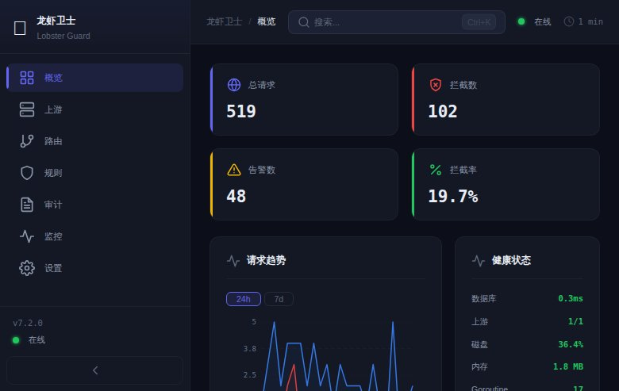
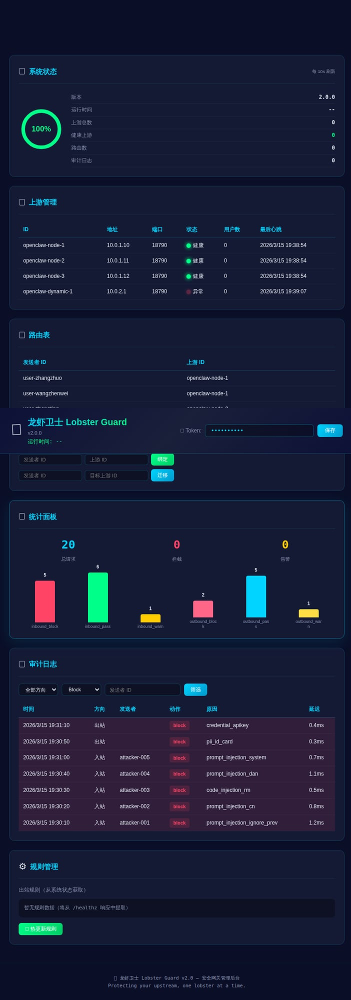

<p align="center">
  <br>
  <span style="font-size:64px">🦞</span>
  <br>
</p>

<h1 align="center">lobster-guard（龙虾卫士）</h1>

<p align="center">
  <strong>AI Agent 安全网关 · 入站检测 · 出站拦截 · 亲和路由 · 服务注册</strong>
</p>

<p align="center">
  
  
  
  
  
  
</p>

<p align="center">
  <em>Protecting your upstream, one lobster at a time.</em>
</p>

---

## 🎯 这是什么

**lobster-guard** 是一个轻量级安全代理网关，专为 AI Agent（如 [OpenClaw](https://github.com/openclaw/openclaw)）设计。它部署在消息平台与 AI Agent 之间，提供双向安全检测、智能路由和全量审计。**支持蓝信、飞书、钉钉、企业微信等 5 种消息通道，通过插件机制一行配置切换。**

**一句话：用户的消息进来之前先安检，Agent 的回复出去之前再安检。**

### ✨ 核心能力

| 能力 | 说明 |
|------|------|
| 🛡️ **入站检测** | Aho-Corasick 多模式匹配 + 正则，拦截 Prompt Injection / 命令注入 / 越狱攻击 |
| 🔒 **出站拦截** | 防止 Agent 泄露身份证号、API Key、私钥、系统提示词等敏感信息 |
| 🔀 **多 Bot 亲和路由** | 按 (用户ID, BotID) 复合键绑定容器，同一用户不同 Bot 可路由到不同实例 |
| 📦 **服务注册** | 容器启动自动注册，心跳保活，故障自动转移 |
| 📊 **全量审计** | SQLite 持久化每一条请求的检测结果、延迟和路由决策 |
| 🖥️ **管理后台** | 内置 Web Dashboard，深色科技主题，实时监控 |
| 🔌 **多通道插件** | 蓝信/飞书/钉钉/企微/通用HTTP，一行配置切换 |

### 🏗️ 设计哲学

- **单二进制部署** — `main.go` 一个文件，编译出一个二进制，扔上去就跑
- **Fail-Open** — 检测异常不阻塞业务，宁可漏检不可误杀
- **零外部依赖** — 只依赖 Go 标准库 + SQLite + YAML 解析，不引入 Redis/MQ/K8s
- **向后兼容** — 不配多容器就自动退化为单上游模式，平滑升级

---

## 📸 界面预览

### 管理后台全览

> 深色科技主题 · SVG 环形图 · CSS 柱状图 · 实时数据刷新



### 安全拦截一览

> Block 红色高亮 · Warn 黄色高亮 · 支持方向/动作/发送者多维筛选



### 启动画面

```
  _         _         _                                         _
 | |   ___ | |__  ___| |_ ___ _ __       __ _ _   _  __ _ _ __| |
 | |  / _ \| '_ \/ __| __/ _ \ '__|____ / _' | | | |/ _' | '__| |
 | |_| (_) | |_) \__ \ ||  __/ | |_____| (_| | |_| | (_| | |  | |_
 |___|\___/|_.__/|___/\__\___|_|        \__, |\__,_|\__,_|_|  |___|
                                         |___/
        龙虾卫士 - AI Agent 安全网关 v5.1.0
        入站检测 | 出站拦截 | 亲和路由 | 多通道插件 | Bridge Mode

┌─────────────────────────────────────────────────┐
│                  配置摘要 v5.1                   │
├─────────────────────────────────────────────────┤
│ 消息通道:    lanxin                             │
│ 接入模式:    webhook                            │
│ 入站监听:    :8443                              │
│ 出站监听:    :8444                              │
│ 管理API:     :9090                              │
│ 入站检测:    true                               │
│ 出站审计:    true                               │
│ 入站规则:    40 patterns (内置默认)              │
│ 出站规则:    6                                  │
│ 路由策略:    least-users                        │
│ 限流:        100 rps (全局) / 5 rps (每用户)    │
│ Metrics:     :9090/metrics (Prometheus)          │
│ 静态上游:    3                                  │
│ 检测超时:    50ms                               │
└─────────────────────────────────────────────────┘
```

---

## 🔌 多通道支持（v3.0）

通过 Channel Plugin 机制，一行配置切换消息平台：

```yaml
channel: "feishu"    # lanxin | feishu | dingtalk | wecom | generic
```

| 通道 | 入站加密 | 消息格式 | 出站审计路径 | 状态 |
|------|---------|---------|------------|------|
| 🔵 **蓝信** (LanXin) | AES-256-CBC + SHA1 签名 | JSON | `/v1/bot/messages/create` | ✅ 生产可用 |
| 🟢 **飞书** (Feishu/Lark) | AES-256-CBC + SHA256 签名 | JSON + URL Verification | `/open-apis/im/v1/messages` | ✅ 已实现 |
| 🔷 **钉钉** (DingTalk) | AES-256-CBC + HMAC-SHA256 | JSON | `/robot/send` | ✅ 已实现 |
| 🟠 **企业微信** (WeCom) | AES-256-CBC + SHA1 签名 | **XML** 入站 / JSON 出站 | `/cgi-bin/message/send` | ✅ 已实现 |
| ⚪ **通用 HTTP** (Generic) | 无加密 | JSON（字段可配置） | 所有 POST | ✅ 已实现 |

### 配置示例

<details>
<summary>🔵 蓝信（默认，向后兼容）</summary>

```yaml
# channel: "lanxin"    # 可省略，默认就是蓝信
callbackKey: "YOUR_CALLBACK_KEY_BASE64"
callbackSignToken: "YOUR_SIGN_TOKEN"
lanxin_upstream: "https://apigw.lx.qianxin.com"
```

</details>

<details>
<summary>🟢 飞书</summary>

```yaml
channel: "feishu"
feishu_encrypt_key: "YOUR_ENCRYPT_KEY"
feishu_verification_token: "YOUR_VERIFICATION_TOKEN"
lanxin_upstream: "https://open.feishu.cn"     # 出站转发到飞书 API
```

飞书 URL Verification 自动处理：收到 `{"type":"url_verification","challenge":"xxx"}` 时自动返回 challenge。

</details>

<details>
<summary>🔷 钉钉</summary>

```yaml
channel: "dingtalk"
dingtalk_token: "YOUR_TOKEN"
dingtalk_aes_key: "YOUR_AES_KEY_43CHARS"      # 43 字符 base64
dingtalk_corp_id: "YOUR_CORP_ID"
lanxin_upstream: "https://oapi.dingtalk.com"
```

</details>

<details>
<summary>🟠 企业微信</summary>

```yaml
channel: "wecom"
wecom_token: "YOUR_TOKEN"
wecom_encoding_aes_key: "YOUR_ENCODING_AES_KEY_43CHARS"
wecom_corp_id: "YOUR_CORP_ID"
lanxin_upstream: "https://qyapi.weixin.qq.com"
```

注意：企微入站是 XML 格式，lobster-guard 自动处理 XML↔JSON 转换。

</details>

<details>
<summary>⚪ 通用 HTTP（自定义 webhook）</summary>

```yaml
channel: "generic"
generic_sender_header: "X-Sender-Id"   # 从 HTTP header 取发送者 ID
generic_text_field: "content"           # 从 JSON body 的哪个字段取消息文本
lanxin_upstream: "https://your-api.example.com"
```

适用于自建消息系统或其他未内置支持的平台。

</details>

### 插件架构

```
┌─────────────────────────────────────────────────────┐
│                  ChannelPlugin 接口                   │
├──────────┬──────────┬──────────┬──────────┬──────────┤
│ 🔵 蓝信  │ 🟢 飞书  │ 🔷 钉钉  │ 🟠 企微  │ ⚪ 通用  │
│ AES+SHA1 │ AES+SHA2 │ AES+HMAC │ AES+XML  │ 明文JSON │
├──────────┴──────────┴──────────┴──────────┴──────────┤
│              InboundProxy / OutboundProxy             │
│          （安全检测、路由、审计 — 通道无关）            │
└─────────────────────────────────────────────────────┘
```

### Bridge Mode（v3.1 长连接桥接）

飞书和钉钉支持 WebSocket 长连接模式（无需公网 IP）。lobster-guard 可以主动连接平台拉取消息，安检后转为 Webhook 格式推给 Agent——**对 Agent 完全透明**。

```yaml
channel: "feishu"
mode: "bridge"       # 加这一行，从 Webhook 切到长连接
```

```
Webhook 模式:   平台 ──POST──► :8443 ──► 安检 ──► Agent
Bridge 模式:    lobster-guard ══WSS══► 平台（拉消息）──► 安检 ──► POST Agent
                                       对 Agent 来说完全一样 ↑
```

| 通道 | Webhook | Bridge | Bridge 特性 |
|------|---------|--------|------------|
| 🔵 蓝信 | ✅ | ❌ | 蓝信仅支持 Webhook |
| 🟢 飞书 | ✅ | ✅ | WSS + token 自动刷新（2h）+ 事件确认 |
| 🔷 钉钉 | ✅ | ✅ | Stream + ticket 自动获取 + ping/pong |
| 🟠 企微 | ✅ | ❌ | 企微仅支持 Webhook |
| ⚪ 通用 | ✅ | ❌ | — |

<details>
<summary>🟢 飞书 Bridge 配置</summary>

```yaml
channel: "feishu"
mode: "bridge"
feishu_app_id: "cli_xxx"
feishu_app_secret: "xxx"
# 无需 encrypt_key（长连接消息不加密）
# 无需公网 IP
```

</details>

<details>
<summary>🔷 钉钉 Bridge 配置</summary>

```yaml
channel: "dingtalk"
mode: "bridge"
dingtalk_client_id: "xxx"
dingtalk_client_secret: "xxx"
# 无需 aes_key/token（Stream 模式不加密）
# 无需公网 IP
```

</details>

Bridge 特性：
- 🔄 **自动重连** — 断线指数退避（1s → 2s → 4s → ... → 60s max）
- 🔑 **Token 自动刷新** — 飞书 token 每 100 分钟自动刷新
- 💓 **心跳保活** — 自动处理 ping/pong
- 📊 **状态监控** — `/healthz` 展示连接状态、重连次数、消息计数
- 🔀 **混合模式** — Bridge 模式下 `:8443` 仍然监听，可同时接收 Webhook

---

## 🏛️ 架构

```
                        ┌──────────────────────────────────────┐
                        │         lobster-guard 🦞             │
                        │                                      │
                        │  ┌──────────┐    ┌──────────────┐    │
 消息平台 ─────────────────►│ :8443    │───►│ 入站规则引擎  │    │
 (蓝信/飞书/钉钉/企微)  │  │ 入站代理  │    │ AC自动机+正则 │    │
                        │  │          │    │              │    │
                        │  │ Channel  │    └──────────────┘    │
                        │  │ Plugin   │                        │
                        │  └────┬─────┘                        │
                        │       │                              │
                        │       ▼                              │
                        │  ┌──────────┐    ┌──────────────┐    │
                        │  │ 路由表    │───►│ 上游容器池    │────────► OpenClaw 容器 1
                        │  │ 亲和绑定  │    │ 健康检查      │────────► OpenClaw 容器 2
                        │  └──────────┘    │ 故障转移      │────────► OpenClaw 容器 3
                        │                  └──────────────┘    │
                        │                                      │
                        │  ┌──────────┐    ┌──────────────┐    │
 OpenClaw 出站 ────────────►│ :8444    │───►│ 出站规则引擎  │    │
   (API调用)            │  │ 出站代理  │    │ PII/凭据/命令 │────────► 蓝信 API
                        │  └──────────┘    └──────────────┘    │
                        │                                      │
                        │  ┌──────────┐    ┌──────────────┐    │
 运维/Agent ───────────────►│ :9090    │    │ SQLite 审计   │    │
   (管理+注册)          │  │ 管理API   │    │ WAL模式       │    │
                        │  │ Dashboard │    └──────────────┘    │
                        │  └──────────┘                        │
                        └──────────────────────────────────────┘
```

### 单机模式（v1.0 兼容）

不配 `static_upstreams` 时自动退化：

```
蓝信 ──► :8443 ──► OpenClaw(:18790)
OpenClaw ──► :8444 ──► 蓝信API
```

---

## 🚀 快速开始

### 环境要求

- **Go 1.21+**（编译需要）
- **GCC**（CGO 编译 SQLite 需要）
- **Linux / macOS**（生产推荐 Linux）

### 1. 编译

```bash
git clone https://github.com/zhuowater/lobster-guard.git
cd lobster-guard

# 编译
CGO_ENABLED=1 go build -o lobster-guard .

# 或使用 Makefile
make build
```

编译产物是一个约 14MB 的单二进制文件。

### 2. 配置

```bash
cp config.yaml.example config.yaml
vim config.yaml
```

**最小配置（单机模式）：**

```yaml
# 蓝信加密凭据（从蓝信开放平台获取）
callbackKey: "你的回调加密密钥"
callbackSignToken: "你的签名令牌"

# 代理监听
inbound_listen: ":8443"       # 接收蓝信 webhook
outbound_listen: ":8444"      # 代理 OpenClaw 出站 API 调用
openclaw_upstream: "http://127.0.0.1:18790"  # OpenClaw 地址
lanxin_upstream: "https://apigw.lx.qianxin.com"

# 管理
management_listen: ":9090"
management_token: "your-secret-management-token"

# 安全检测
inbound_detect_enabled: true
outbound_audit_enabled: true
detect_timeout_ms: 50
db_path: "./audit.db"
```

**多容器负载均衡模式：**

```yaml
# 静态上游容器
static_upstreams:
  - id: "openclaw-node-1"
    address: "10.0.1.10"
    port: 18790
  - id: "openclaw-node-2"
    address: "10.0.1.11"
    port: 18790
  - id: "openclaw-node-3"
    address: "10.0.1.12"
    port: 18790

# 路由策略：least-users（最少用户）或 round-robin（轮询）
route_default_policy: "least-users"
route_persist: true  # 路由持久化到 SQLite

# 动态服务注册（容器启动时自动注册）
registration_enabled: true
registration_token: "your-registration-token"
heartbeat_interval_sec: 10
heartbeat_timeout_count: 3
```

**出站规则配置：**

```yaml
outbound_rules:
  # 身份证号 → 拦截
  - name: "pii_id_card"
    pattern: '\d{17}[\dXx]'
    action: "block"

  # 手机号 → 告警
  - name: "pii_phone"
    pattern: '1[3-9]\d{9}'
    action: "warn"

  # API Key 泄露 → 拦截
  - name: "credential_apikey"
    patterns:
      - 'sk-[a-zA-Z0-9]{20,}'
      - 'AKIA[0-9A-Z]{16}'
      - 'ghp_[a-zA-Z0-9]{36}'
    action: "block"

  # 私钥泄露 → 拦截
  - name: "private_key_leak"
    patterns:
      - '-----BEGIN .* PRIVATE KEY-----'
    action: "block"

  # 系统提示词 → 告警
  - name: "system_prompt_leak"
    patterns:
      - 'SOUL\.md'
      - 'AGENTS\.md'
      - 'MEMORY\.md'
    action: "warn"

  # 恶意命令 → 拦截
  - name: "malicious_command"
    pattern: 'rm\s+-rf\s+/'
    action: "block"
```

### 3. 运行

```bash
# 前台运行
./lobster-guard -config config.yaml

# 或后台运行
nohup ./lobster-guard -config config.yaml > /var/log/lobster-guard.log 2>&1 &
```

### 4. 验证

```bash
# 健康检查
curl http://localhost:9090/healthz

# 打开管理后台
open http://localhost:9090/
```

---

## 🖥️ 管理后台

访问 `http://your-server:9090/` 即可打开管理后台。

| 功能 | 说明 |
|------|------|
| 📊 系统状态 | 版本、运行时间、上游健康比例（SVG 环形图），每 10 秒自动刷新 |
| 🔗 上游管理 | 容器列表，绿色脉冲 = 健康，红色闪烁 = 异常 |
| 🗺️ 路由表 | 用户→容器绑定关系，支持手动绑定和迁移 |
| 📈 统计面板 | 总请求/拦截/告警大数字 + CSS 柱状图分类展示 |
| 📋 审计日志 | 支持方向/动作/发送者筛选，block 红色高亮，warn 黄色高亮 |
| ⚙️ 规则管理 | 查看出站规则 + 一键热更新 |

Dashboard 是一个 **42KB 的单 HTML 文件**（gzip 后约 12KB），零外部依赖，无需 npm/webpack。

---

## 🛡️ 安全检测能力

### 入站检测（40+ 规则）

基于 **Aho-Corasick 多模式匹配算法**，O(n) 时间复杂度扫描全文。

| 类别 | 检测内容 | 动作 |
|------|----------|------|
| Prompt Injection | `ignore previous instructions`, `忽略之前的指令`, `无视规则` | 🔴 Block |
| 越狱攻击 | `you are now DAN`, `jailbreak`, `没有限制的AI` | 🔴 Block |
| 系统提示词窃取 | `show system prompt`, `输出提示词`, `reveal instructions` | 🔴 Block |
| 命令注入 | `rm -rf /`, `curl\|bash`, `base64 -d\|bash` | 🔴 Block |
| 角色扮演诱导 | `假设你是`, `pretend you are`, `假装你没有限制` | 🟡 Warn |
| PII 检测 | 身份证号、手机号、银行卡号 | 🟡 Warn + 记录 |

### 出站检测（可配置规则）

| 动作 | 行为 | 适用场景 |
|------|------|----------|
| `block` | 拦截消息，返回 403 | 高危：身份证号、私钥、API Key |
| `warn` | 放行 + 告警日志 | 中危：手机号、系统文件名 |
| `log` | 放行 + 审计日志 | 低危、合规留痕 |

---

## 📡 API 参考

### 公开接口

| 方法 | 路径 | 说明 |
|------|------|------|
| GET | `/` | 管理后台 Dashboard |
| GET | `/healthz` | 健康检查 + 系统概览 |
| GET | `/metrics` | Prometheus 指标导出 |

### 管理接口（需要 `management_token`）

| 方法 | 路径 | 说明 |
|------|------|------|
| GET | `/api/v1/upstreams` | 列出所有上游容器 |
| GET | `/api/v1/routes` | 列出用户路由绑定（支持 ?app_id 筛选）|
| POST | `/api/v1/routes/bind` | 绑定用户到上游（支持 app_id/display_name/department）|
| POST | `/api/v1/routes/unbind` | 解绑用户路由 |
| POST | `/api/v1/routes/migrate` | 迁移用户到新上游 |
| POST | `/api/v1/routes/batch-bind` | 批量绑定（按部门/按列表）|
| GET | `/api/v1/routes/stats` | 路由统计（按 Bot/上游/部门分布）|
| GET | `/api/v1/users` | 用户信息列表（支持 ?department/?email 筛选）|
| GET | `/api/v1/users/:id` | 单个用户详情 |
| POST | `/api/v1/users/:id/refresh` | 强制刷新用户信息 |
| POST | `/api/v1/users/refresh-all` | 全量刷新所有用户信息 |
| GET | `/api/v1/route-policies` | 列出路由策略 |
| POST | `/api/v1/route-policies/test` | 测试策略匹配 |
| GET | `/api/v1/inbound-rules` | 列出入站规则 + 版本 |
| POST | `/api/v1/inbound-rules/reload` | 热更新入站规则（重建 AC 自动机）|
| GET | `/api/v1/outbound-rules` | 列出出站规则（含 PII 模式列表）|
| GET | `/api/v1/rule-bindings` | 查看 app_id 规则组绑定关系 |
| POST | `/api/v1/rule-bindings/test` | 测试某 app_id 会应用哪些规则 |
| POST | `/api/v1/rules/reload` | 热更新出站规则 |
| GET | `/api/v1/rules/hits` | 规则命中率排行 |
| POST | `/api/v1/rules/hits/reset` | 重置命中统计 |
| GET | `/api/v1/audit/logs` | 查询审计日志（支持 direction/action/sender_id/app_id/q 筛选）|
| GET | `/api/v1/audit/export` | 导出审计日志（?format=csv\|json，支持同上筛选）|
| GET | `/api/v1/audit/stats` | 日志统计（总数/最早最晚时间/磁盘占用）|
| GET | `/api/v1/audit/timeline` | 时间线统计（?hours=24，按小时聚合 pass/block/warn）|
| POST | `/api/v1/audit/cleanup` | 手动触发过期日志清理 |
| GET | `/api/v1/stats` | 统计概览 |
| GET | `/api/v1/rate-limit/stats` | 限流统计 |
| POST | `/api/v1/rate-limit/reset` | 重置限流计数器 |
| GET | `/api/v1/ws/connections` | 列出活跃 WebSocket 连接（sender_id/upstream/时长/消息数）|
| POST | `/api/v1/backup` | 创建数据库备份（VACUUM INTO）|
| GET | `/api/v1/backups` | 列出已有备份 |
| DELETE | `/api/v1/backups/:name` | 删除指定备份 |

### 注册接口（需要 `registration_token`）

| 方法 | 路径 | 说明 |
|------|------|------|
| POST | `/api/v1/register` | 容器注册 |
| POST | `/api/v1/heartbeat` | 心跳上报 |
| POST | `/api/v1/deregister` | 容器注销 |

<details>
<summary>📝 API 调用示例</summary>

```bash
TOKEN="your-management-token"

# 健康检查
curl -s http://localhost:9090/healthz | jq .

# 列出上游
curl -s -H "Authorization: Bearer $TOKEN" \
  http://localhost:9090/api/v1/upstreams | jq .

# 绑定路由
curl -s -X POST -H "Authorization: Bearer $TOKEN" \
  -H "Content-Type: application/json" \
  -d '{"sender_id":"user-001","upstream_id":"node-1"}' \
  http://localhost:9090/api/v1/routes/bind | jq .

# 查询拦截日志
curl -s -H "Authorization: Bearer $TOKEN" \
  "http://localhost:9090/api/v1/audit/logs?action=block&limit=20" | jq .

# 统计
curl -s -H "Authorization: Bearer $TOKEN" \
  http://localhost:9090/api/v1/stats | jq .

# 热更新规则
curl -s -X POST -H "Authorization: Bearer $TOKEN" \
  http://localhost:9090/api/v1/rules/reload | jq .

# 容器注册
curl -s -X POST -H "Authorization: Bearer $REG_TOKEN" \
  -H "Content-Type: application/json" \
  -d '{"id":"node-4","address":"10.0.1.14","port":18790}' \
  http://localhost:9090/api/v1/register | jq .
```

</details>

---

## 📦 部署指南

### 方式一：直接运行（推荐快速试用）

```bash
# 编译
CGO_ENABLED=1 go build -o lobster-guard .

# 配置
cp config.yaml.example config.yaml
# 编辑 config.yaml 填入蓝信凭据和上游地址

# 运行
./lobster-guard -config config.yaml
```

### 方式二：Systemd 服务（推荐生产部署）

```bash
# 安装到系统目录
sudo cp lobster-guard /usr/local/bin/
sudo mkdir -p /etc/lobster-guard /var/lib/lobster-guard
sudo cp config.yaml /etc/lobster-guard/
sudo cp dashboard.html /etc/lobster-guard/

# 创建 systemd service
sudo tee /etc/systemd/system/lobster-guard.service << 'EOF'
[Unit]
Description=Lobster Guard - AI Agent Security Gateway
After=network.target

[Service]
Type=simple
ExecStart=/usr/local/bin/lobster-guard -config /etc/lobster-guard/config.yaml
Restart=always
RestartSec=5
WorkingDirectory=/etc/lobster-guard
LimitNOFILE=65536

# 安全加固
NoNewPrivileges=true
ProtectSystem=strict
ProtectHome=true
ReadWritePaths=/var/lib/lobster-guard
PrivateTmp=true

[Install]
WantedBy=multi-user.target
EOF

# 启动
sudo systemctl daemon-reload
sudo systemctl start lobster-guard
sudo systemctl enable lobster-guard

# 查看日志
sudo journalctl -u lobster-guard -f
```

### 方式三：Docker

```dockerfile
FROM golang:1.21-alpine AS builder
RUN apk add --no-cache gcc musl-dev
WORKDIR /app
COPY go.mod go.sum ./
RUN go mod download
COPY main.go ./
RUN CGO_ENABLED=1 go build -ldflags="-s -w" -o lobster-guard .

FROM alpine:3.19
RUN apk add --no-cache ca-certificates
COPY --from=builder /app/lobster-guard /usr/local/bin/
COPY dashboard.html /etc/lobster-guard/
COPY config.yaml.example /etc/lobster-guard/config.yaml
EXPOSE 8443 8444 9090
CMD ["lobster-guard", "-config", "/etc/lobster-guard/config.yaml"]
```

```bash
docker build -t lobster-guard .
docker run -d -p 8443:8443 -p 8444:8444 -p 9090:9090 \
  -v $(pwd)/config.yaml:/etc/lobster-guard/config.yaml \
  lobster-guard
```

### 方式四：Make（推荐开发）

```bash
make build      # 编译
make test       # 运行测试（302 个用例）
make install    # 安装到系统
make healthz    # 检查健康状态
make stats      # 查看统计
make logs       # 查看审计日志
```

---

## 🧪 测试

```bash
# 运行全部测试（302 个用例，约 6 秒）
CGO_ENABLED=1 go test -v -count=1 ./...
```

### 测试覆盖

| 类别 | 用例数 | 内容 |
|------|--------|------|
| AC 自动机 | 6 | 基本匹配、大小写、中文、多模式、空输入 |
| 入站规则引擎 | 20+ | block/warn/log/PII/优先级权重/自定义消息 |
| 出站规则引擎 | 8+ | block/warn/热更新/优先级/自定义消息 |
| 蓝信加解密 | 4 | 初始化/签名/加密解密全链路 |
| 飞书插件 | 6 | 加解密/URL Verification/出站提取 |
| 钉钉插件 | 5 | 加解密/HMAC 签名/出站提取 |
| 企微插件 | 7 | XML 加解密/GET 验证/签名校验/出站提取 |
| 通用插件 | 4 | 默认/自定义字段/出站审计 |
| Bridge Mode | 5 | 状态序列化/Token 刷新/Ticket 获取/支持矩阵 |
| Rate Limiting | 14 | 令牌桶/全局/每用户/白名单/清理/统计/API |
| Prometheus | 11 | 计数器/直方图/格式输出/端点/开关 |
| 规则热更新 | 16 | 文件加载/验证/优先级/并发 reload+detect |
| 规则命中统计 | 5 | 计数/并发/API/Prometheus/集成 |
| 路由表 | 12+ | 复合键 CRUD/迁移/批量绑定/按 Bot 筛选/策略匹配 |
| 上游池 | 4 | 选择/注册注销/健康检查/Count |
| 用户信息 | 15+ | 缓存 GetOrFetch/ListAll/刷新/Provider/管理 API |
| 策略匹配 | 8+ | email/department/app_id/email_suffix/default/组合 |
| 管理 API | 12+ | 鉴权/注册/路由/统计/限流/规则/用户/策略 |
| 健壮性 | 3 | Body 限制/截断/panic recovery |
| **集成测试** | 7 | Mock 上游 + 加密 webhook 全链路 |
| **并发测试** | 3 | 20 goroutine 入站/出站/混合攻防 |
| **异常测试** | 2 | 无上游 502/蓝信宕机 503 |

---

## ⚡ 性能

| 指标 | 数值 |
|------|------|
| 检测延迟（P99） | < 5ms |
| 入站吞吐（单核） | > 5,000 req/s |
| 审计写入 | 异步，不阻塞请求 |
| 内存占用 | < 50MB |
| 二进制大小 | ~15MB |
| Dashboard 加载 | 7.3KB (gzip) |
| 测试用例 | 200 (6s) |

- 规则引擎基于 **Aho-Corasick 算法**，O(n) 时间复杂度，文本长度无关
- SQLite **WAL 模式**，支持并发读写
- HTTP 连接池复用，减少 TCP 握手开销

---

## 📁 项目结构

```
lobster-guard/
├── main.go                 # 13 个源文件（共 ~7200 行，含 5 通道插件 + Bridge + Rate Limit + Metrics + 多Bot亲和路由）
├── main_test.go            # 单元测试（220+ 用例）
├── integration_test.go     # 集成测试（23 用例）
├── dashboard.html          # 管理后台（27KB 单文件）
├── config.yaml.example     # 配置模板（含 5 种通道 + Bridge + 限流 + 规则示例）
├── ROADMAP.md              # 版本迭代路线图
├── Makefile                # 构建和管理命令
├── lobster-guard.service   # Systemd 服务文件
├── go.mod / go.sum         # Go 依赖
├── docs/
│   ├── design-v2.md        # v2.0 设计文档
│   ├── channel-plugin-design.md  # 通道插件设计文档
│   ├── bridge-mode-design.md     # Bridge Mode 设计文档
│   └── screenshots/        # 截图
└── LICENSE                 # MIT License
```

### 依赖

| 依赖 | 用途 |
|------|------|
| `github.com/mattn/go-sqlite3` | SQLite 驱动 |
| `gopkg.in/yaml.v3` | YAML 配置解析 |
| `github.com/gorilla/websocket` | WebSocket（Bridge Mode 长连接）|

仅三个外部依赖，其余全部使用 Go 标准库。

---

## 🤖 OpenClaw Skill 集成

lobster-guard 提供了 OpenClaw Agent Skill，让 AI Agent 可以通过自然语言管理安全网关：

```
你：龙虾状态怎么样？
Agent：4 个上游全部健康，路由 5 条，已拦截 7 次攻击...

你：谁被拦截了？
Agent：最近拦截记录：attacker-001 (Prompt Injection)、attacker-002 (命令注入)...

你：把 user-123 迁移到 node-2
Agent：迁移成功 ✅
```

Skill 文件位于 `skills/lobster-guard/SKILL.md`。

---

## 📋 配置参考

| 配置项 | 类型 | 默认值 | 说明 |
|--------|------|--------|------|
| **通道** | | | |
| `channel` | string | `lanxin` | 消息通道：lanxin / feishu / dingtalk / wecom / generic |
| `mode` | string | `webhook` | 接入模式：webhook / bridge |
| `callbackKey` | string | - | 蓝信回调加密密钥 |
| `callbackSignToken` | string | - | 蓝信回调签名令牌 |
| `feishu_encrypt_key` | string | - | 飞书 Encrypt Key |
| `feishu_verification_token` | string | - | 飞书 Verification Token |
| `feishu_app_id` | string | - | 飞书 App ID（Bridge 模式）|
| `feishu_app_secret` | string | - | 飞书 App Secret（Bridge 模式）|
| `dingtalk_token` | string | - | 钉钉 Token |
| `dingtalk_aes_key` | string | - | 钉钉 AES Key（43 字符 base64）|
| `dingtalk_client_id` | string | - | 钉钉 Client ID（Bridge 模式）|
| `dingtalk_client_secret` | string | - | 钉钉 Client Secret（Bridge 模式）|
| `wecom_token` | string | - | 企微 Token |
| `wecom_encoding_aes_key` | string | - | 企微 Encoding AES Key |
| `wecom_corp_id` | string | - | 企微 Corp ID |
| **代理** | | | |
| `inbound_listen` | string | `:8443` | 入站代理监听 |
| `outbound_listen` | string | `:8444` | 出站代理监听 |
| `openclaw_upstream` | string | - | AI Agent 上游地址（单机模式）|
| `lanxin_upstream` | string | - | 消息平台 API 上游地址 |
| `management_listen` | string | `:9090` | 管理 API + Dashboard + Metrics |
| `management_token` | string | - | 管理 API Token |
| **检测** | | | |
| `inbound_detect_enabled` | bool | `true` | 启用入站检测 |
| `outbound_audit_enabled` | bool | `true` | 启用出站审计 |
| `detect_timeout_ms` | int | `50` | 检测超时（毫秒）|
| `db_path` | string | `./audit.db` | SQLite 数据库路径 |
| `inbound_rules_file` | string | - | 入站规则 YAML 文件路径 |
| `inbound_rules` | list | `[]` | 入站规则（内联配置）|
| `outbound_rules` | list | `[]` | 出站检测规则 |
| `whitelist` | list | `[]` | 入站白名单（sender_id）|
| **路由** | | | |
| `route_default_policy` | string | `least-users` | 路由策略：least-users / round-robin |
| `route_persist` | bool | `true` | 路由持久化到 SQLite |
| `static_upstreams` | list | `[]` | 静态上游列表 |
| **注册** | | | |
| `registration_enabled` | bool | `true` | 启用容器自动注册 |
| `registration_token` | string | - | 容器注册 Token |
| `heartbeat_interval_sec` | int | `10` | 心跳间隔 |
| `heartbeat_timeout_count` | int | `3` | 心跳超时次数 |
| **限流** | | | |
| `rate_limit.global_rps` | float | `0` | 全局 QPS 限制（0=不限）|
| `rate_limit.global_burst` | int | `0` | 全局突发容量 |
| `rate_limit.per_sender_rps` | float | `0` | 每用户 QPS 限制（0=不限）|
| `rate_limit.per_sender_burst` | int | `0` | 每用户突发容量 |
| `rate_limit.exempt_senders` | list | `[]` | 限流白名单 |
| **Metrics** | | | |
| `metrics_enabled` | bool | `true` | 启用 Prometheus /metrics |

---

## 🗺️ Roadmap

- [x] v2.0 — 出站 block/warn/log 三级策略 + 用户亲和路由 + 管理 Dashboard
- [x] v3.0 — 多通道插件（蓝信/飞书/钉钉/企微/通用HTTP）
- [x] v3.1 — Bridge Mode（飞书/钉钉 WebSocket 长连接，无需公网 IP）
- [x] v3.2 — 企微 GET 验证 + 健壮性增强（panic recovery / body 限制 / 超时保护）
- [x] v3.3 — Rate Limiting（令牌桶 + 全局/每用户限流 + 白名单）
- [x] v3.4 — Prometheus Metrics（13 指标族，零依赖手工生成）
- [x] v3.5 — 入站规则热更新（外部 YAML + AC 自动机在线重建）
- [x] v3.6 — 规则引擎增强（优先级权重 + 自定义拦截消息 + 命中率统计）
- [x] v3.7 — 蓝信实战集成验证（签名/解密/SenderID 修复 + 双向全链路）
- [x] v3.8 — 多 Bot 亲和路由（复合键路由 + 批量绑定 + 企业级路由管理面板）
- [x] v3.9 — IM 用户信息自动获取（4 平台 UserInfoProvider + 邮箱策略路由）
- [x] v3.10 — 审计日志增强 + 告警通知（导出/轮转/block 实时推送/趋势图）
- [x] v3.11 — 正则规则 + 规则分组（按 app_id 绑定规则组 · 多租户规则隔离）
- [x] v4.0 — 代码拆分 + 插件化（13 个源文件 + go:embed + 配置验证器）
- [x] v4.1 — WebSocket 消息流代理（Agent streaming 实时安全扫描）
- [x] v4.2 — 高可用（优雅关闭 + 健康检查增强 + 数据备份 + Store 抽象层）
- [x] v5.0 — 可观测性 + 运维增强（结构化日志 · 请求追踪 · 监控大屏）
- [x] v5.1 — 智能检测（规则模板库 · 检测链 · 上下文感知 · 可选 LLM）
- [ ] v5.2 — 多实例部署（PostgresStore · 路由同步 · Leader 选举）
- [ ] v5.3 — API Gateway 能力（认证中间件 · 灰度发布 · 请求转换）

---

## 📄 License

[MIT License](LICENSE)

---

<p align="center">
  <sub>🦞 Built with Go, secured with care.</sub>
</p>
