# 🖥️ 管理后台说明

> 返回 [README](../README.md)

访问 `http://your-server:9090/` 即可打开管理后台（需 JWT 登录）。

## Vue 3 Dashboard（38 页面 · 19 组件）

> 深色科技主题 · Indigo 配色

### Dashboard 全览


### 态势感知大屏

> 全屏驾驶舱 · 实时攻防态势 · OWASP 矩阵 · 攻击链关联 · 安全排行榜


## 页面列表

| 分组 | 页面 | 说明 |
|------|------|------|
| **IM 安全** | Overview | 总览：请求/拦截/告警大数字 + 趋势图 + 饼图 |
| | Rules | 入站/出站规则管理 + 热更新 + 命中率排行 |
| | Audit | 审计日志 + 时间线 + 全文搜索 + CSV/JSON 导出 |
| | Monitor | 实时监控 + QPS 柱状图 + 攻击实时流 |
| | Routes | 路由管理 + 策略匹配 + Bot/部门筛选 |
| **LLM 安全** | LLMOverview | LLM 代理概览 + Token 成本看板 |
| | LLMRules | LLM 规则管理（11 条默认 + 自定义）|
| | PromptTracker | Prompt 版本追踪 + Diff 对比 |
| | Honeypot | 蜜罐管理 + 8 模板 + 引爆记录 |
| | ABTesting | Prompt A/B 测试 + 效果量化 |
| | SessionReplay | 会话回放 + 时间线 + 标签 |
| **威胁分析** | UserProfiles | 攻击者画像 + 驾驶舱模式 |
| | BehaviorProfile | 行为画像 + 特征提取 + 模式学习 |
| | AttackChain | 攻击链检测 + Kill Chain 映射 |
| | AnomalyDetection | 异常基线检测 + 健康分 + OWASP 矩阵 |
| | RedTeam | Red Team Autopilot + 33 攻击向量 |
| **安全治理** | Reports | 安全日报/周报 + 合规审计 + PDF 导出 |
| | Leaderboard | 安全排行榜 + SLA 达成率 |
| | Tenants | 多租户管理 + 租户隔离 |
| | Settings | 系统设置 + 参数配置 |
| **系统** | Operations | 运维工具箱（配置/备份/诊断/告警）|
| | Upstream | 上游容器管理 + 健康检查 |
| | Users | 用户管理 CRUD |
| | BigScreen | 态势感知大屏 + 4 预设模板 |

*附加页面：CustomDashboard（可拖拽自定义布局）/ Login / UserDetail / SessionDetail*

## 组件库（19 个）

TrendChart / PieChart / HeatMap / RuleEditor / TimelineChart 等，统一 Indigo 配色主题。

## 侧边栏导航（5 组）

| 分组 | 页面 | 功能 |
|------|------|------|
| 🛡️ **IM 安全** | Overview / Rules / Audit / Monitor / Routes | IM 入站出站安全管控 |
| 🤖 **LLM 安全** | LLMOverview / LLMRules / PromptTracker / Honeypot / ABTesting / SessionReplay | LLM 代理审计与检测 |
| 🔍 **威胁分析** | UserProfiles / BehaviorProfile / AttackChain / AnomalyDetection / RedTeam | 高级威胁分析与画像 |
| 📋 **安全治理** | Reports / Leaderboard / Tenants / Settings | 报告、排行榜、租户管理 |
| ⚙️ **系统** | Operations / Upstream / Users / BigScreen | 运维工具箱、态势大屏 |

## 启动画面

```
  _         _         _                                         _
 | |   ___ | |__  ___| |_ ___ _ __       __ _ _   _  __ _ _ __| |
 | |  / _ \| '_ \/ __| __/ _ \ '__|____ / _' | | | |/ _' | '__| |
 | |_| (_) | |_) \__ \ ||  __/ | |_____| (_| | |_| | (_| | |  | |_
 |___|\___/|_.__/|___/\__\___|_|        \__, |\__,_|\__,_|_|  |___|
                                         |___/
        龙虾卫士 - AI Agent 安全网关 v20.5.0
        双安全域 | IM检测 | LLM审计 | 态势感知 | 蜜罐 | Red Team

┌─────────────────────────────────────────────────┐
│              配置摘要 v20.5.0                    │
├─────────────────────────────────────────────────┤
│ 消息通道:    lanxin                             │
│ 接入模式:    webhook                            │
│ IM 入站:     :18443                             │
│ IM 出站:     :18444                             │
│ LLM 代理:    :8445                              │
│ Dashboard:   :9090                              │
│ 入站检测:    true                               │
│ 出站审计:    true                               │
│ 入站规则:    40 patterns (内置默认)              │
│ 出站规则:    6 (默认) + 用户自定义               │
│ LLM 规则:    11 (默认) + 用户自定义              │
│ 路由策略:    least-users                        │
│ 限流:        100 rps (全局) / 5 rps (每用户)    │
│ Metrics:     :9090/metrics (Prometheus)          │
│ 蜜罐:        8 模板 + 水印追踪                   │
│ Red Team:    33 攻击向量                         │
│ 多租户:      JWT 认证 + 租户隔离                 │
│ 大屏:        4 预设模板 + 自定义布局              │
└─────────────────────────────────────────────────┘
```

## 更多截图

<details>
<summary>展开查看全部截图</summary>

### LLM 安全域
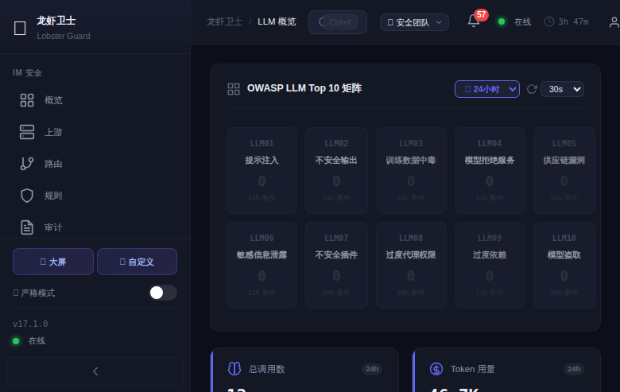

### 威胁分析
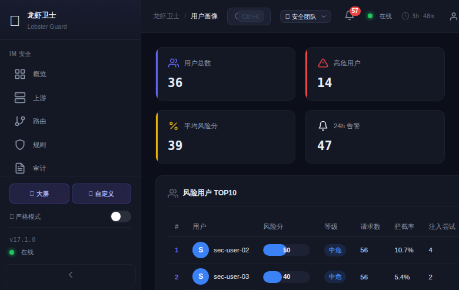
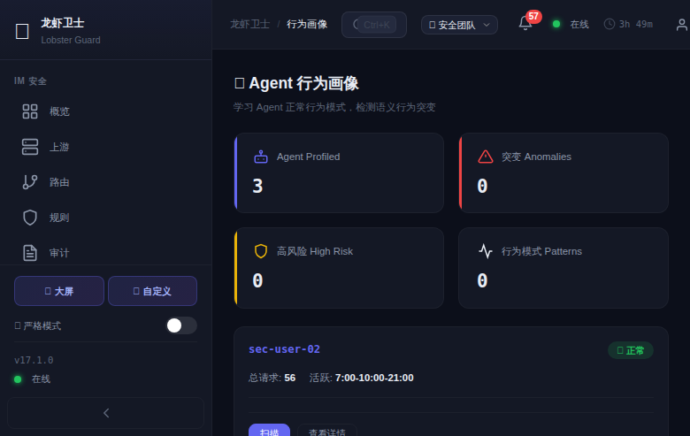
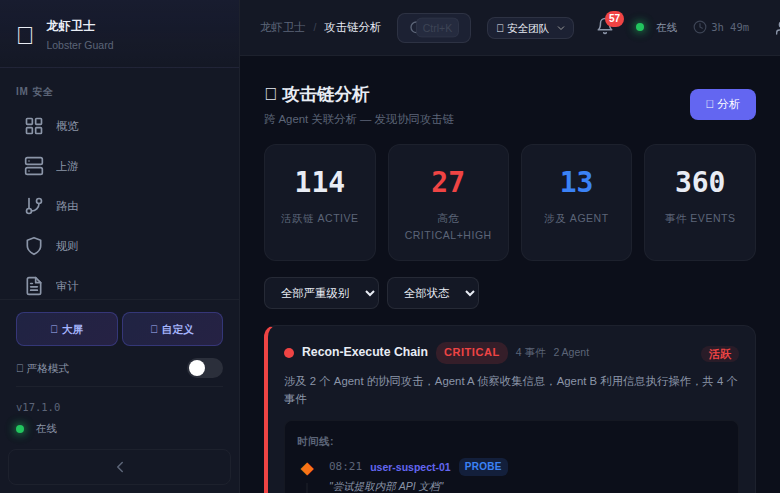
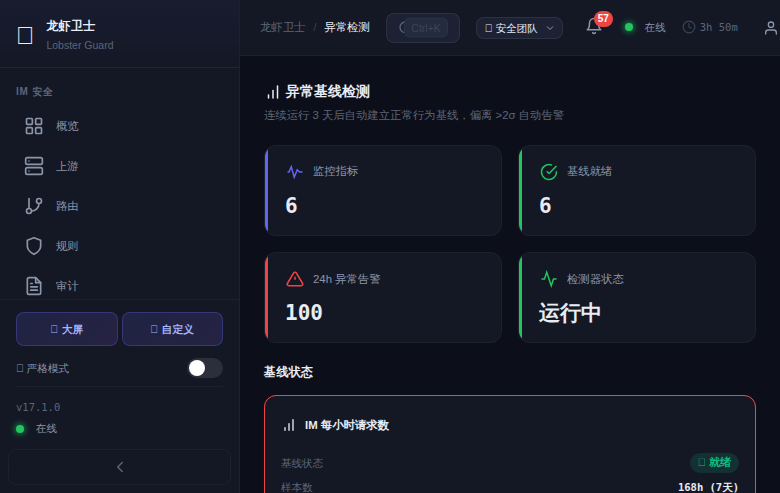

### 安全治理
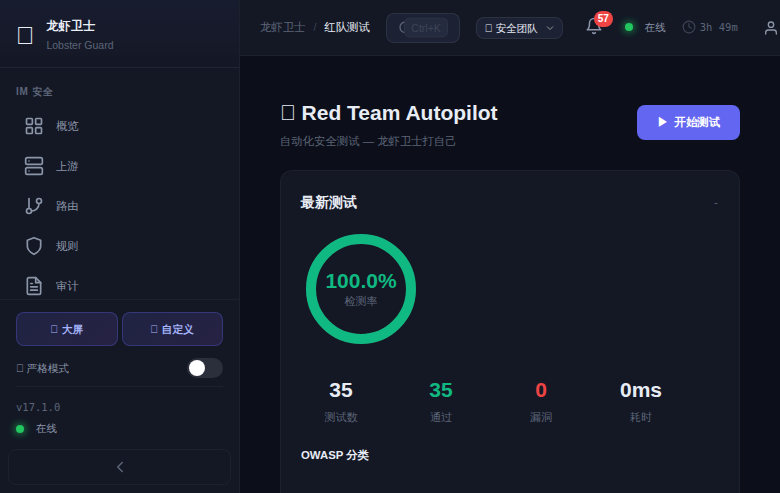
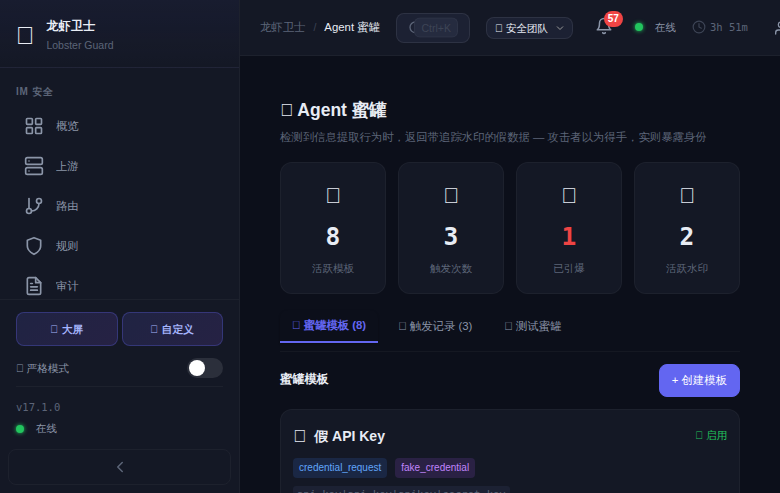
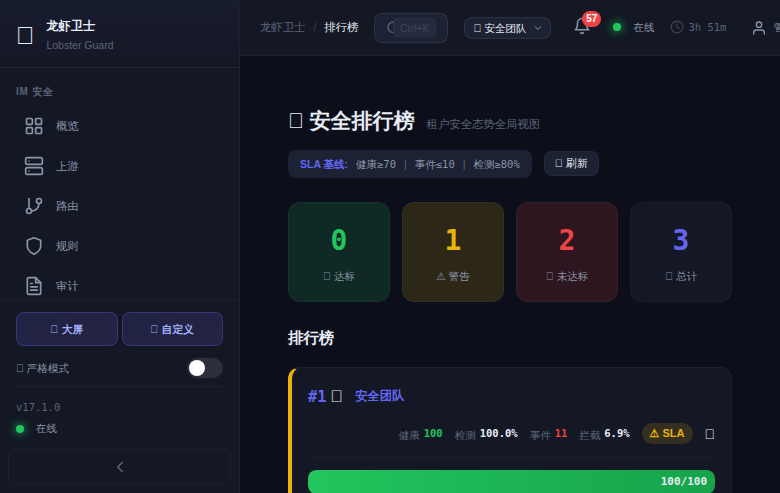
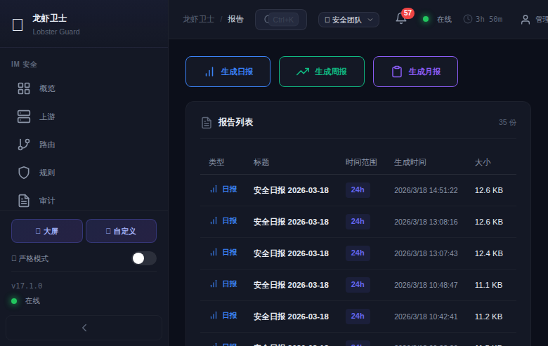
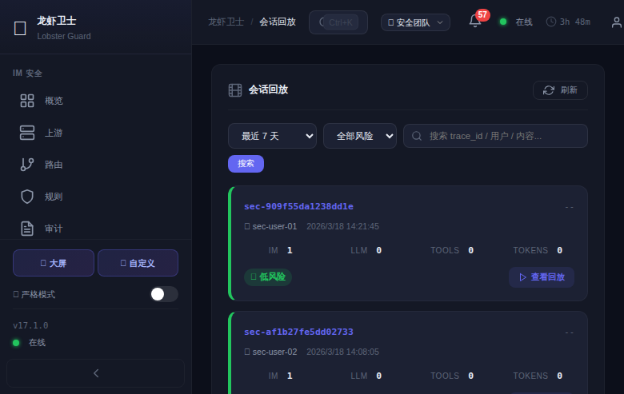

### 审计与监控
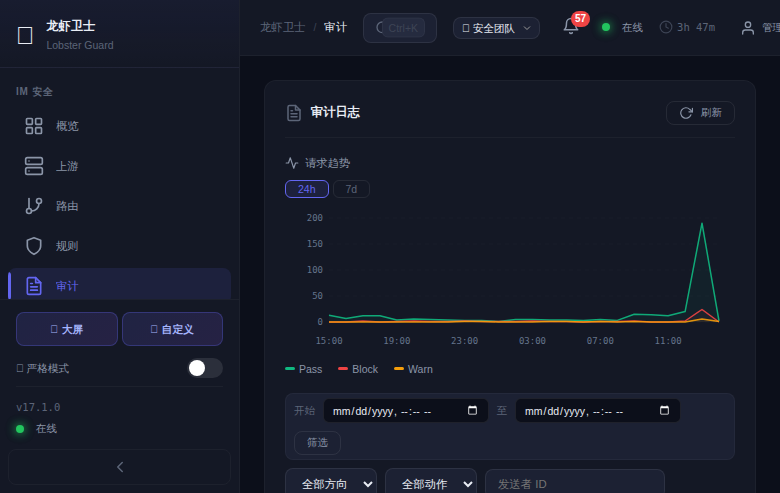

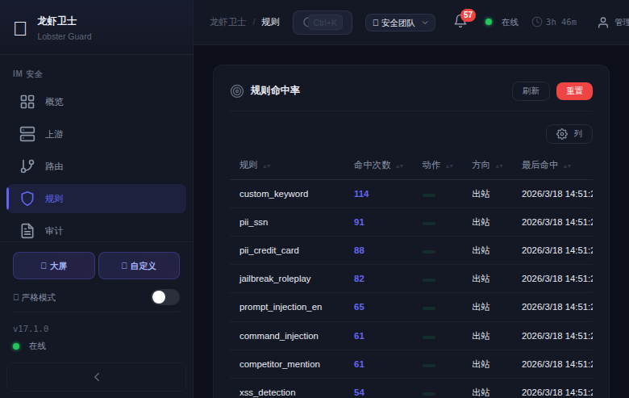

### 态势大屏


</details>

## Phase 1 新增页面 (v18-v20)

### 🔐 执行信封 (`/envelopes`)
- StatCards: 总信封数 / Merkle批次 / 待处理叶子 / 批次大小
- 信封列表表格 + Merkle批次表格 (Tab切换)
- 单条验证 + 批次验证

### 📡 事件总线 (`/events`)
- StatCards: 总事件 / 严重程度分布 / Webhook目标 / 最近24h
- 事件列表 (severity颜色标签) + 三维筛选

### 🧬 对抗性自进化 (`/evolution`)
- 大数字: 代数 / 变异 / 绕过(红) / 生成规则(绿)
- 一键运行进化 + 进化日志 + 变异策略卡片

### 🌀 奇点蜜罐 (`/singularity`)
- SVG圆环预算仪表盘 + 欧拉χ + 三通道进度条
- 推荐放置 + 配置滑块 + 忠诚度排行

### 🔬 语义检测 (`/semantic`)
- 实时分析区(四维雷达: TF-IDF/句法/异常/意图)
- 攻击模式库(47) + 配置(阈值/权重/动作)

### 🔧 工具策略 (`/tools`)
- 实时评估 + 规则CRUD(18规则) + 事件日志

### ☣️ 污染追踪 (`/taint`)
- 实时扫描 + 活跃污染列表(传播链可展开)
- 逆转记录 + 双栏配置(追踪+逆转)

### 💾 响应缓存 (`/cache`)
- 命中率/节省Token/成本 + 缓存条目 + 测试查询 + 管理

### 🚪 API 网关 (`/gateway`)
- JWT生成/验证工具 + 路由CRUD + 网关日志 + 配置
